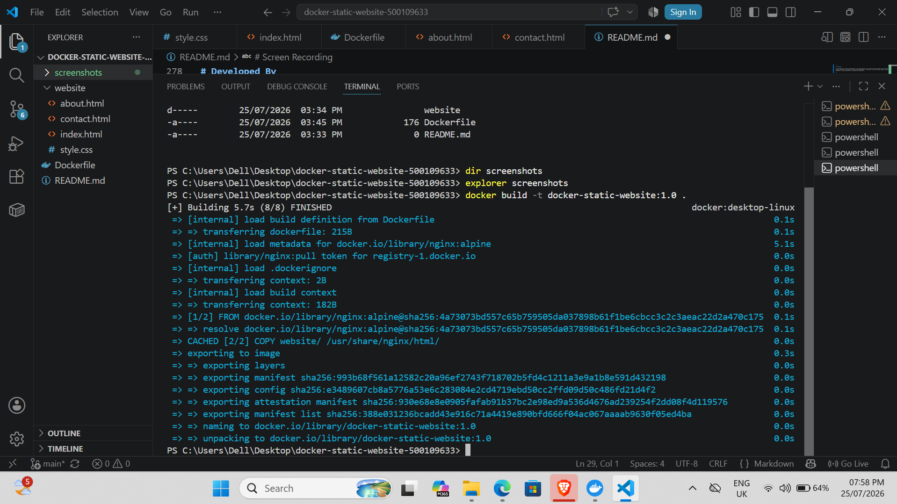
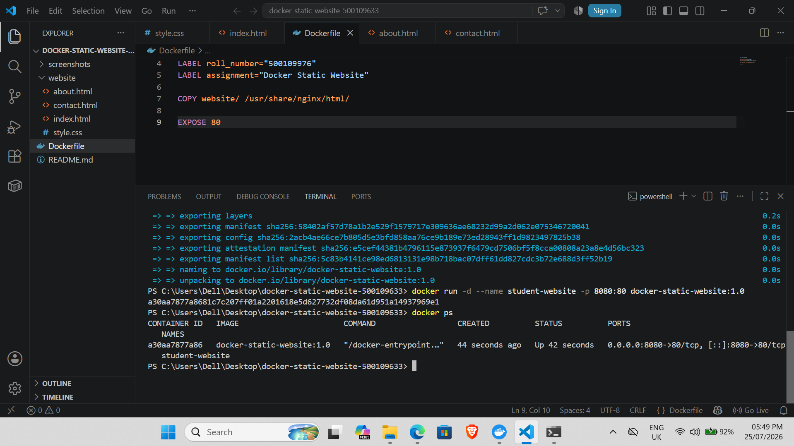
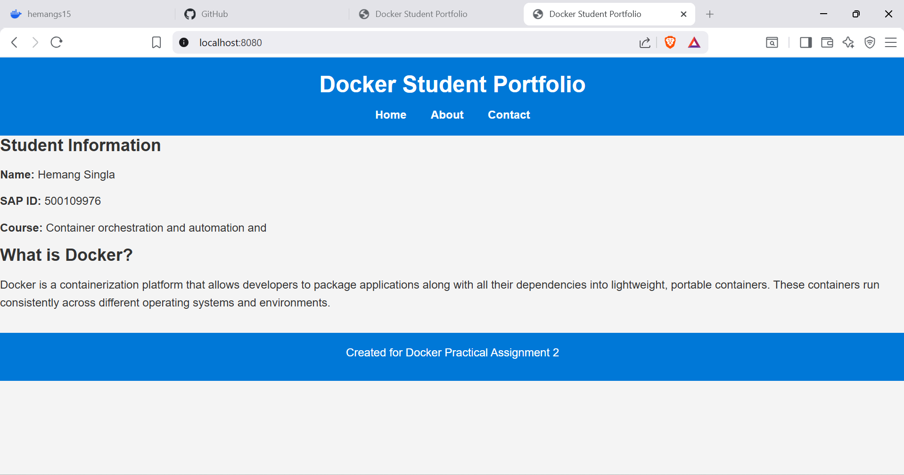
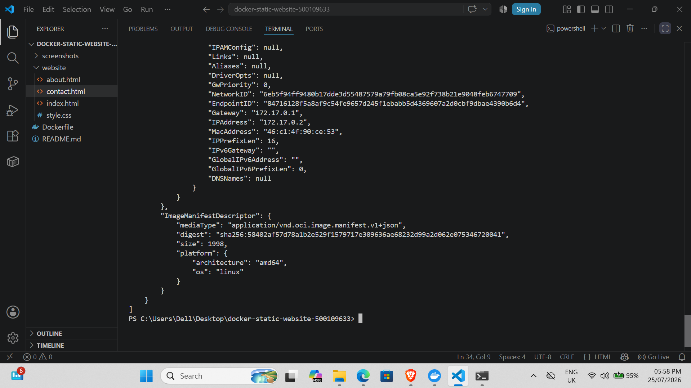

# Dockerize a Static Website and Publish the Work on GitHub

## Student Details

**Name:** Hemang Singla

**SAP ID / Roll Number:** 500109633

**Assignment:** Remedial Practical Assignment 2

**Course:** Container Orchestration and Automation Lab

---

# Project Objective

The objective of this assignment is to create a three-page static website, deploy it inside an Nginx Docker container, document the project using GitHub, and demonstrate the working of Docker commands.

---

# GitHub Repository

https://github.com/hemang15singla/docker-static-website-500109633

---

# Screen Recording

https://drive.google.com/file/d/1wxAdGueynTajRx-ChLBvH8nh9omhKb9U/view?usp=drivesdk

---

# Project Structure

```text
docker-static-website-500109633/
│
├── Dockerfile
├── README.md
├── website/
│   ├── index.html
│   ├── about.html
│   ├── contact.html
│   └── style.css
│
└── screenshots/
    ├── 01-docker-build.png
    ├── 02-container-running.png
    ├── 03-home-page.png
    └── 04-docker-inspect.png
```

---

# Website Description

## Home Page

- Student Name
- SAP ID
- Course Name
- Introduction to Docker
- Navigation links

## About Page

Contains the following Docker concepts:

- Docker Images
- Docker Containers
- Dockerfile
- Docker Hub
- Docker Volumes

Each concept is explained briefly.

## Contact Page

Contains:

- Student Name
- Institutional Email
- GitHub Repository Link
- Statement confirming that the website runs inside a Docker container.

---

# Dockerfile

```dockerfile
FROM nginx:alpine

LABEL student="Hemang Singla"
LABEL roll_number="500109633"
LABEL assignment="Docker Static Website"

COPY website/ /usr/share/nginx/html/

EXPOSE 80
```

---

# Answers for Question 2

## Why was nginx:alpine selected?

The nginx:alpine image is lightweight, fast, consumes less storage, and is ideal for serving static websites.

### What does COPY do?

The COPY instruction copies the website files from the local project folder into the Nginx web directory inside the Docker container.

### What is the purpose of EXPOSE 80?

EXPOSE 80 tells Docker that the container listens for HTTP traffic on port 80.

### Difference between host port 8080 and container port 80

Port 8080 is the port on the local computer.

Port 80 is the web server port inside the Docker container.

Using:

docker run -p 8080:80

maps host port 8080 to container port 80.

---

# Docker Commands Used

```bash
docker --version
```

```bash
docker build -t docker-static-website:1.0 .
```

```bash
docker images
```

```bash
docker run -d --name student-website -p 8080:80 docker-static-website:1.0
```

```bash
docker ps
```

```bash
docker logs student-website
```

```bash
docker inspect student-website
```

```bash
docker exec student-website ls /usr/share/nginx/html
```

```bash
docker stop student-website
```

```bash
docker start student-website
```

---

# Answers for Question 3

## Meaning of -d

Runs the container in detached mode so it continues running in the background.

## Purpose of --name student-website

Assigns a custom name to the Docker container for easy identification.

## Meaning of -p 8080:80

Maps local machine port 8080 to port 80 inside the Docker container.

## What does docker ps display?

It lists all currently running Docker containers with their ID, image, status, ports and names.

## What is docker inspect used for?

It displays detailed configuration and metadata about a Docker container.

---

# Screenshots

## Docker Build



---

## Running Container



---

## Website Output



---

## Docker Inspect



---

# Technologies Used

- HTML5
- CSS3
- Docker
- Nginx Alpine
- Git
- GitHub
- Visual Studio Code

---

# Conclusion

This project successfully demonstrates how a static website can be containerized using Docker and deployed using an Nginx web server. The project includes Docker image creation, container execution, GitHub documentation and supporting screenshots.

---

# Developed By

**Hemang Singla**

SAP ID: **500109633**

UPES Dehradun